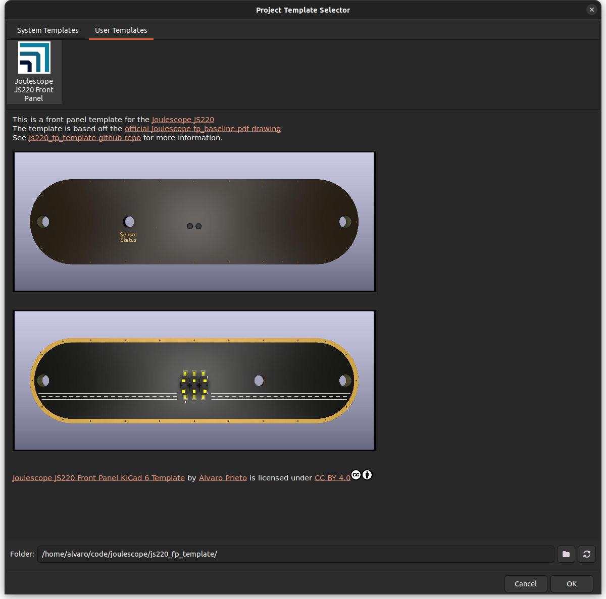

# Joulescope JS220 Front Panel KiCad 6 Template

This is a front panel template for the [Joulescope JS220](https://www.joulescope.com/products/js220-joulescope-precision-energy-analyzer)

The template is based off the [official Joulescope fp_baseline.pdf drawing](https://github.com/jetperch/js220_end_panels/blob/main/eagle/fp_baseline/fp_baseline.pdf).

Here are some renders of what it should look like:

**DISCLAIMER** - This template matches the documentation as best as I can tell, but I have not yet manufactured any boards with it. I will update this message after I receive my first boards using it :D

## Installation Instructions
Clone/download this repo and copy into your KiCad template directory. Alternatively, you can just go to File->New Project From Template and change the folder to point to this directory.

## Manufacturing Information
For more information, check out the official [Joulescope Front Panels](https://github.com/jetperch/js220_end_panels) github repo.

## License
Joulescope JS220 Front Panel KiCad 6 Template © 2022 by Alvaro Prieto is licensed under CC BY 4.0. To view a copy of this license, visit http://creativecommons.org/licenses/by/4.0/
